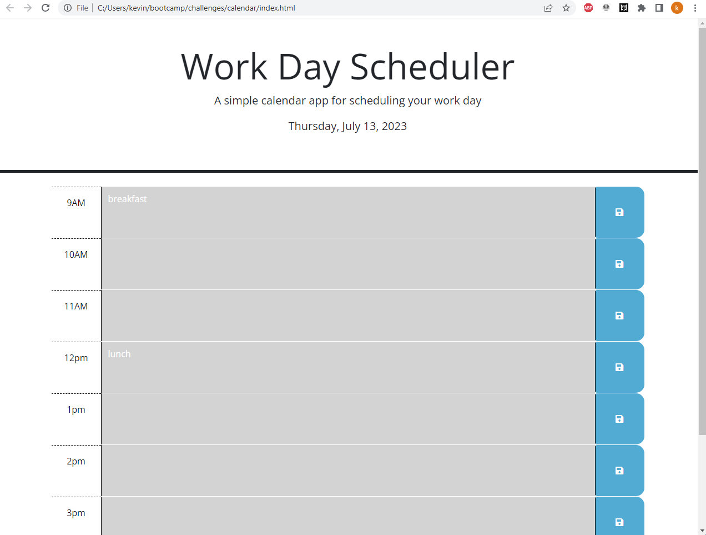
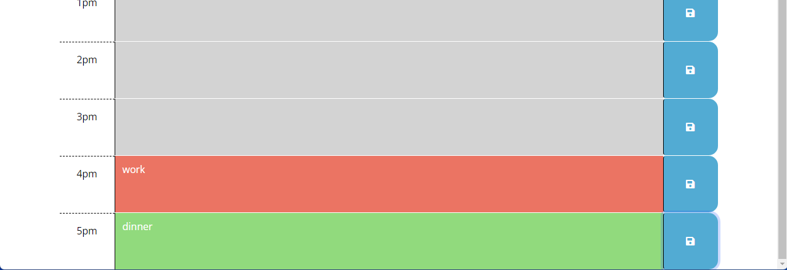

# calendar
## Description
### I created a website that shows the times between 9 and 5. You can save an event to each time slot and hit the save buttone which will store your info in local storage. The background color of each hour is determined by the time of the day.
## Links
###
[Website]https://kdonnelly33.github.io/calendar/
[Repository]https://github.com/KDonnelly33/calendar
## Screenshots

